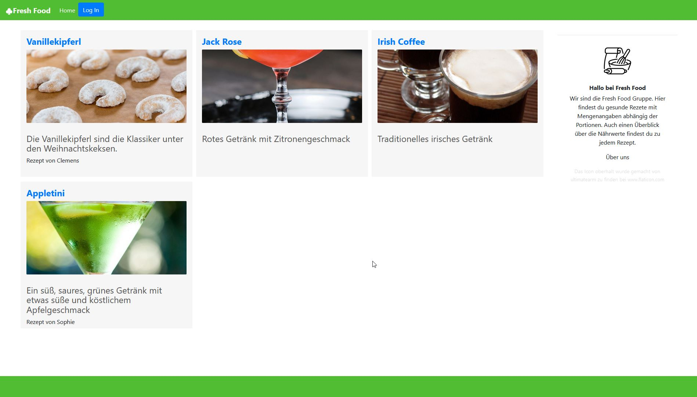
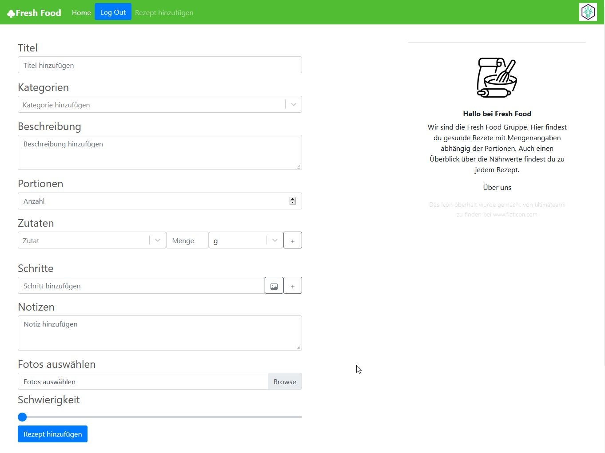

## A Recipe Web App
A Webapp to view upload and create recipes. The App is based on Nodejs, React and Bootstrap. The authentication functionallity is made with 0Auth.

Recipe View with login functionallity. Made by [@Codingsimon](https://github.com/Codingsimon)
 
 
 

Form for creating new recipes. Made by: [@Pawedla](https://github.com/Pawedla)
 
The App uses a Java Spring Boot Backend. The communication between frontend and backend is done via REST. Backend made by [@clebuch](https://github.com/clebuch)

## Installation
Clone the Repository.
Download and install the framework Nodejs https://nodejs.org/en/download/
Type `npm install` in the project root folder to install dependencies
Type `npm start` to run the Website

Runs the app in the development mode.\
Open [http://localhost:3000](http://localhost:3000) to view it in the browser.
