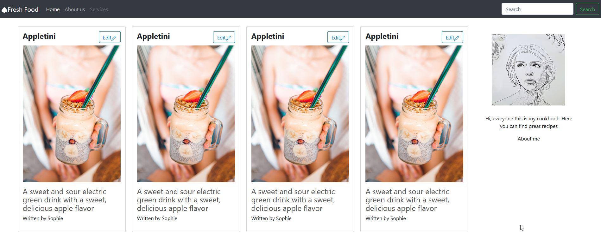

# The Frontend of a Cookbook website with ingredient amout calculations for portions

This project is made with [Create React App](https://github.com/facebook/create-react-app).

## Install

In order to run React you need to install Node.js (https://nodejs.org/en/)

Install npm to manage dependencies (https://www.npmjs.com/get-npm)
intall Axios

Go to the project directory studyapp-frontend with

### `cd studyapp-frontend`

Use npm to install all dependencies with

### `npm install`

To start the app use

### `npm start`

Runs the app in the development mode.\
Open [http://localhost:3000](http://localhost:3000) to view it in the browser.